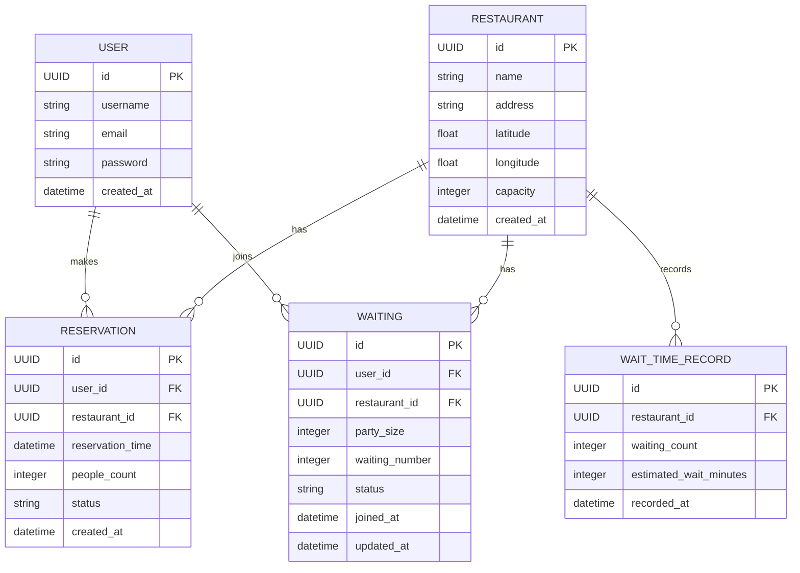
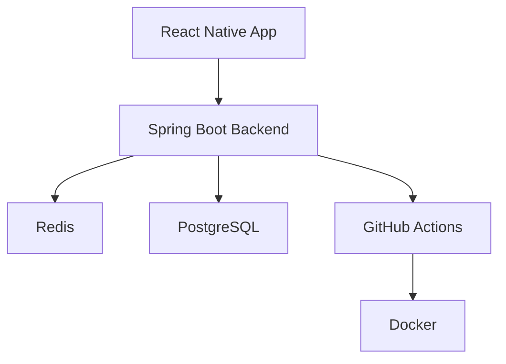

# NoWait: 🍽️ 음식점 예상 대기시간 예측 및 예약 서비스

> **백엔드 개발 능력 향상을 목표로 하는 1인 프로젝트로, 실시간 예상 대기시간과 최적 방문 시간 추천을 통해 고객 경험을 혁신합니다.**

 

## 💡 프로젝트 배경

기존 음식점 예약 서비스는 식당 대기 현황만 제공할 뿐, 정확한 예상 대기시간 정보를 제공하지 않습니다. 본 프로젝트는 **실시간 대기시간 예측**을 통해 고객들이 합리적이고 효율적인 방문 결정을 내릴 수 있도록 돕고, 과거 패턴 분석을 통한 **최적 방문 시간 추천** 및 **개인화된 추천**을 제공합니다.

 

## 기획 아키텍처 목표

| 목표 영역           | 상세 내용                                             |
| --------------- | ------------------------------------------------- |
| **빠른 MVP 구현**   | - 1개월 내 핵심 기능을 완성하여 신속히 사용자 피드백 반영                |
| **정확한 대기시간 예측** | - 실시간 및 과거 데이터를 기반으로 정확한 대기시간 제공                  |
| **고성능 트랜잭션 처리** | - Redis 분산락과 PostgreSQL MVCC를 활용하여 동시성 문제 해결      |
| **실시간 사용자 경험**  | - WebSocket(STOMP) 기반 실시간 데이터 업데이트 제공             |
| **효율적 배포 환경**   | - Docker Compose, GitHub Actions를 활용한 자동화 배포 구축   |
| **모니터링 및 관찰성**  | - AWS CloudWatch Logs, Spring Actuator로 서비스 상태 관리 |
| **확장 가능 아키텍처**  | - 모듈형 설계를 통해 서비스 확장 용이성 확보                        |

 

## 주요 기술 스택

| 레이어          | 기술                                                                             | 핵심 강점                       |
| ------------ | ------------------------------------------------------------------------------ | --------------------------- |
| **프론트엔드**    | React Native, Zustand, React Query                                             | 크로스 플랫폼 지원, 효율적 상태 관리       |
| **백엔드**      | Spring Boot 3.5.3, Java 17, Spring Security, Spring Data JPA, WebSocket(STOMP) | 안정적이고 신속한 백엔드 개발, 실시간 통신    |
| **DB/캐시**    | PostgreSQL 15, Redis 7.2, Redisson                                             | 고성능 트랜잭션 처리, 동시성 관리 및 빠른 캐싱 |
| **인프라 및 배포** | Docker, Docker Compose, AWS EC2, AWS RDS, AWS ElastiCache, GitHub Actions      | 환경 일관성 및 자동화된 배포 시스템        |
| **모니터링**     | AWS CloudWatch Logs, Spring Boot Actuator                                      | 최소 비용, 최대 효율 모니터링           |
| **API 문서화**  | Swagger/OpenAPI                                                                | 자동 문서화 및 쉬운 협업              |
| **성능 테스트**   | Apache JMeter, JProfiler                                                       | 서비스 성능 검증 및 최적화             |

 

## ERD Diagram

 

## 핵심 기술 구성도

 

## 📅 개발 일정

### 1개월 MVP 개발

| 주차     | 작업 내용                           |
| ------ | ------------------------------- |
| Week 1 | 프로젝트 설정, 인증 및 DB 설계, 기본 UI      |
| Week 2 | 대기열 관리, Redis 동시성 처리, DB 쿼리 최적화 |
| Week 3 | WebSocket 실시간 업데이트, 기본적 대기시간 예측 |
| Week 4 | 성능 최적화 및 AWS 배포, 자동화 구축         |

 

### 추가 확장 일정

* Kafka 도입 및 이벤트 기반 설계 (선택적)
* ML 기반 예측모델 고도화 (향후 개선 예정)

 

## 백엔드 개발자로서 얻을 수 있는 역량

* 실시간 동시성 문제 해결 및 최적화
* 고성능 트랜잭션 처리 능력 향상
* 클라우드 인프라 및 배포 자동화 구축 경험
* 효율적인 모니터링 및 문제 대응 능력

 

## 참고 자료

* [Yelp Waitlist - ML 기반 대기시간 예측](https://engineeringblog.yelp.com/2019/12/architecting-wait-time-estimations.html)

---

✨ **본 프로젝트는 개발 효율성을 높이고 사용자에게 최상의 경험을 제공하기 위해 최신 기술과 최적의 아키텍처 설계를 적용했습니다.**
