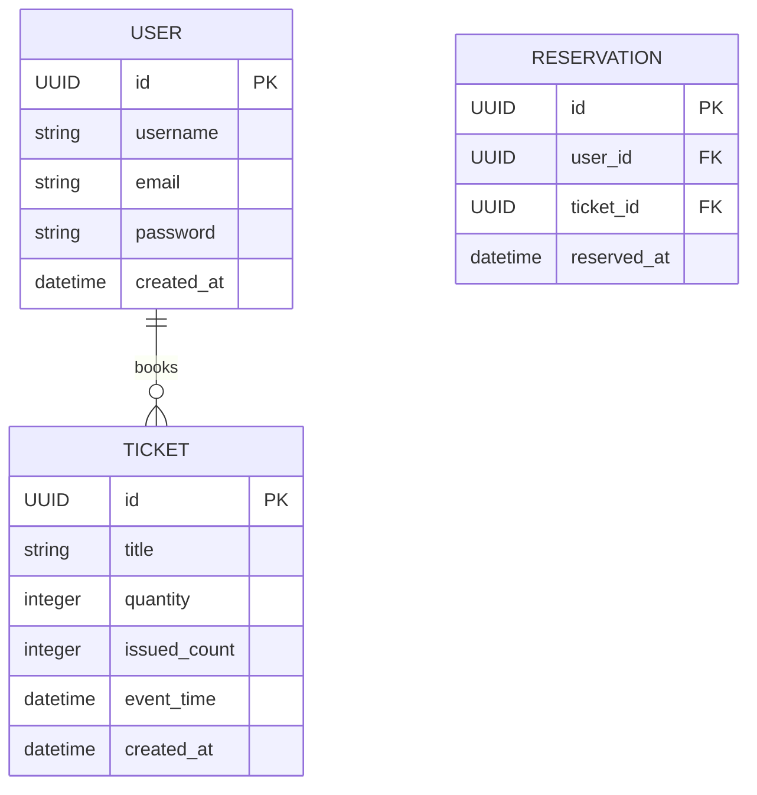
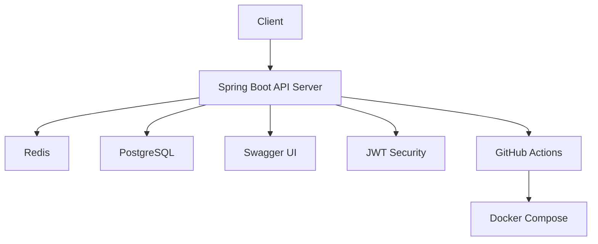

# 🛎️ FastTicket: Redis 기반 선착순 티켓팅 서비스

> **실시간 동시성 처리와 백엔드 기술 강화를 위한 1인 마이크로 프로젝트입니다.**

 

## 💡 프로젝트 개요

기존의 티켓팅 시스템에서는 동시다발적인 요청이 몰릴 경우 서버 부하나 중복 처리 등의 문제가 발생합니다.   
이 프로젝트는 **Redis 분산락과 트랜잭션 처리**를 통해 선착순 티켓팅 로직을 안정적으로 처리하는 **마이크로 백엔드 서비스**를 구현하는 것을 목표로 합니다.

 

## 🎯 핵심 목표

| 목표 영역           | 상세 내용                                       |
| --------------- | ------------------------------------------- |
| **동시성 처리 안정화**  | Redis 분산락으로 중복 요청/동시 요청을 제어하고, 순차적 자원 배분 보장 |
| **유저 인증 구현**    | Spring Security + JWT 기반 로그인/회원가입 구현        |
| **트랜잭션 안정성 확보** | Redis 처리 이후 DB에 안전하게 반영되도록 트랜잭션 처리 구성       |
| **단순 배포 구성**    | Docker 및 GitHub Actions를 통한 CI/CD 간소화       |

 

## ⚙️ 주요 기술 스택

| 레이어          | 기술                                                           | 주요 목적                  |
| ------------ | ------------------------------------------------------------ | ---------------------- |
| **백엔드**      | Spring Boot 3.5.3, Java 17, Spring Security, Spring Data JPA | 인증 처리, 트랜잭션, REST API  |
| **DB/캐시**    | PostgreSQL 15, Redis 7.2, Redisson                           | 유저 데이터 저장, 락 기반 동시성 제어 |
| **배포 및 인프라** | Docker, Docker Compose, GitHub Actions                       | 환경 통일화 및 자동화 배포        |
| **문서화**      | Swagger/OpenAPI                                              | API 명세 문서 자동 생성        |

 

## 🗂️ ERD Diagram

 

## 🧩 핵심 기술 구성도

 

## ⏱️ 개발 범위 및 기능

* 회원가입 / 로그인 (JWT)
* 티켓 등록 / 조회 / 삭제 (관리자용 API)
* 티켓팅 신청 API (선착순 락 처리)
* Swagger UI를 통한 테스트 및 문서 제공

 

## ✅ 백엔드 개발자로서 얻게 되는 역량

* 실전 Redis 분산락 및 동시성 제어 경험
* Spring Security를 활용한 인증 처리 흐름 이해
* 트랜잭션 전파와 예외 처리 패턴 학습
* 마이크로서비스 단위로 기능 설계 및 배포하는 경험

 

## 📚 참고 자료

* [Redisson 공식 문서](https://github.com/redisson/redisson/wiki/8.-Distributed-locks-and-synchronizers)
* [Baeldung - Redis Lock](https://www.baeldung.com/spring-redis-lock)

---

✨ **이 프로젝트는 복잡한 시스템 전 단계로서, 핵심 기술 역량을 빠르게 검증하고 실전에 가까운 환경을 구축하는 데 목적이 있습니다.**
